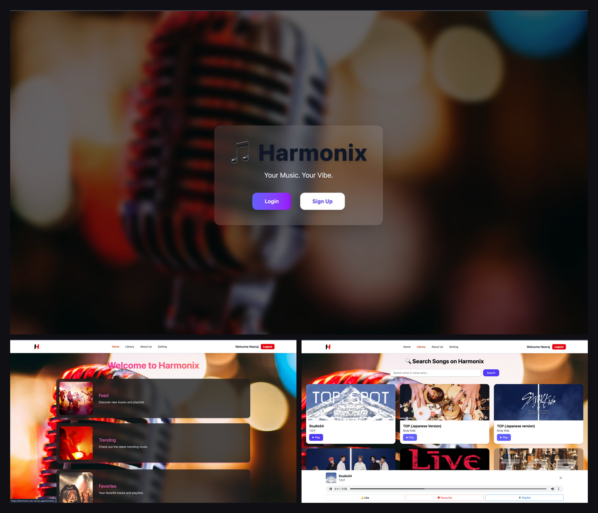

# 🎵 Harmonix

A full-featured music web app built with **React**, **Firebase**, and the **iTunes Search API**. Users can search for songs, build playlists, like tracks, and manage their music library — all with dark mode support and a responsive UI.

🔗 **Live Demo**: [harmonix-psi.vercel.app](https://harmonix-psi.vercel.app)

---

## 📸 Screenshots


> *(Add screenshots here — drag and drop images into this file on GitHub)*

---

## ✨ Features

- 🔐 **Authentication** — Sign up / Log in with Firebase Auth
- 🔍 **Search Songs** — Real-time search powered by the iTunes Search API (15M+ tracks)
- ▶️ **30-second Previews** — Instantly preview any song in the browser
- ❤️ **Like & Favourite** — Save songs to your liked and favourite collections
- 📂 **Custom Playlists** — Create and manage your own playlists
- 📈 **Trending & Feed** — Explore trending music and discover new artists
- 🌙 **Dark Mode** — Full dark/light theme toggle
- 🔤 **Font Size Control** — Accessibility-friendly font size settings
- 📱 **Responsive Design** — Works on mobile, tablet, and desktop

---

## 🛠️ Tech Stack

| Technology | Usage |
|---|---|
| React 18 | Frontend UI |
| Vite | Build tool |
| Tailwind CSS | Styling |
| Firebase Auth | User authentication |
| iTunes Search API | Song data & previews |
| React Router v6 | Client-side routing |
| Context API | Global state (dark mode, font size) |
| localStorage | Playlist & liked songs persistence |
| Vercel | Deployment |

---

## 🚀 Getting Started

### Prerequisites
- Node.js v18+
- npm or yarn

### Installation

```bash
# 1. Clone the repository
git clone https://github.com/Neeraj-singh140805/Harmonix.git
cd Harmonix

# 2. Install dependencies
npm install

# 3. Set up Firebase
# Create a .env file in the root and add your Firebase config:
```

```env
VITE_FIREBASE_API_KEY=your_api_key
VITE_FIREBASE_AUTH_DOMAIN=your_auth_domain
VITE_FIREBASE_PROJECT_ID=your_project_id
VITE_FIREBASE_STORAGE_BUCKET=your_storage_bucket
VITE_FIREBASE_MESSAGING_SENDER_ID=your_sender_id
VITE_FIREBASE_APP_ID=your_app_id
```

```bash
# 4. Start the development server
npm run dev
```

---

## 📁 Project Structure

```
src/
├── Components/
│   ├── Navbar.jsx        # Responsive navbar with hamburger menu
│   ├── Home.jsx          # Dashboard with section links
│   ├── Library.jsx       # Search songs + music player
│   ├── Feed.jsx          # Music feed
│   ├── Trending.jsx      # Trending tracks
│   ├── Favorites.jsx     # Favourite songs
│   ├── LikedSongs.jsx    # Liked songs
│   ├── Playlists.jsx     # User playlists
│   ├── Setting.jsx       # Dark mode & font size
│   ├── Login.jsx         # Firebase login
│   ├── SignUp.jsx        # Firebase sign up
│   ├── Welcome.jsx       # Landing page
│   ├── AboutUs.jsx       # About page
│   └── Footer.jsx        # Footer
├── context/
│   └── SettingContext.jsx # Dark mode & font size context
├── firebase.js           # Firebase config
├── App.jsx               # Routes & layout
└── main.jsx              # Entry point
```

---

## 🔒 Authentication Flow

- Users land on the **Welcome** page
- Must **Sign Up / Log In** with Firebase Auth to access the app
- Protected routes redirect unauthenticated users to `/login`
- User session stored in `localStorage`

---

## 🌐 Deployment

The app is deployed on **Vercel** with automatic deployments on every push to `main`.

To deploy your own fork:

```bash
# Install Vercel CLI
npm i -g vercel

# Deploy
vercel
```

---

## 🤝 Contributing

Pull requests are welcome! For major changes, please open an issue first.

1. Fork the repo
2. Create your branch: `git checkout -b feature/your-feature`
3. Commit your changes: `git commit -m 'Add some feature'`
4. Push to the branch: `git push origin feature/your-feature`
5. Open a Pull Request

---

## 👨‍💻 Author

**Neeraj Singh**
- GitHub: [@Neeraj-singh140805](https://github.com/Neeraj-singh140805)

---